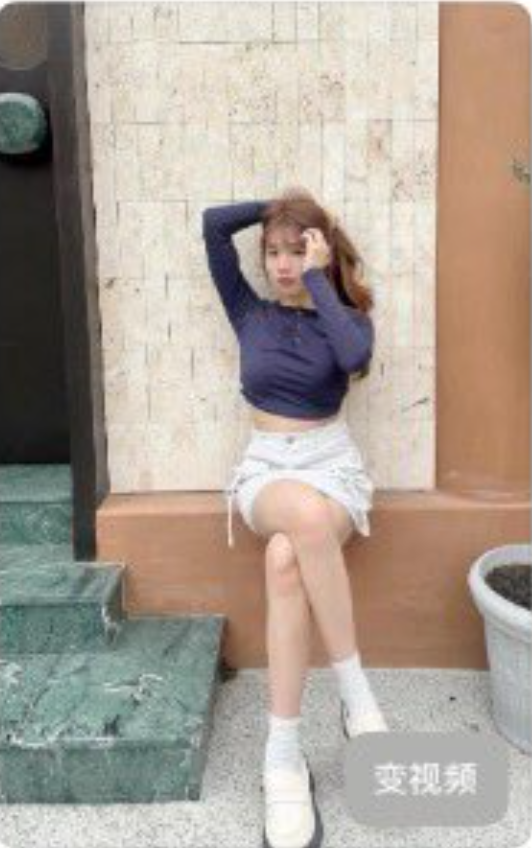

<a id="readme-top"></a>
# Awesome-Seedream-Four-Images✨

[](LICENSE)
[](README_en.md)
[](README.md)

🎉 欢迎来到 Seedream 4.0 生成图片收集精选！

这是一个精选的 Seedream 4.0 生成图像与提示词合集。借助Seedream 4.0，全面展示 Seedream 4.0 在中文AI 图像生成方面的前沿能力，并不断探索创意表达的新可能。

案例主要来源于 X 和 小红书社区，希望这些案例能为您带来启发 💡，为你的灵感加速 🚀。

<strong>→ 喜欢就点 Star 支持！ / Smash that ⭐ if you like it!</strong>


---

<a id="table-of-contents"></a>
## 目录

- [📖 案例目录](#cases-toc)
- [💡 提示词技巧](#prompting-tips)
- [🤝 如何贡献](#how-to-contribute)
- [🙏 致谢](#acknowledgements)
- [🌟 Star历史](#star-history)


---

<a id="cases-toc"></a>
## 📖 案例目录

- [Awesome-Seedream-Four-Images✨](#awesome-seedream-four-images)
  - [目录](#目录)
  - [📖 案例目录](#-案例目录)
  - [🧩 案例](#-案例)
    - [案例 18：制作立体冰箱贴 (by @宫臣良田)](#案例-18制作立体冰箱贴-by-宫臣良田)
    - [案例 17：制作扁平风格插画 (by @nicekate8888)](#案例-17制作扁平风格插画-by-nicekate8888)
    - [案例 16：制作国风多格漫画 (by @nicekate8888)](#案例-16制作国风多格漫画-by-nicekate8888)
    - [案例 15：制作自媒体多风格知识卡片 (by @op7418)](#案例-15制作自媒体多风格知识卡片-by-op7418)
    - [案例 14：制作PPT页面 (by @op7418)](#案例-14制作ppt页面-by-op7418)
    - [案例 13：为角色添加妆造 (by @op7418)](#案例-13为角色添加妆造-by-op7418)
    - [案例 12：制作公司VI视觉设计 (by @OdysseAI\_)](#案例-12制作公司vi视觉设计-by-odysseai_)
    - [案例 11：制作产品设计蓝图 (by @irisloveli)](#案例-11制作产品设计蓝图-by-irisloveli)
    - [案例 10：制作食谱图 (by @ZPanming18622)](#案例-10制作食谱图-by-zpanming18622)
    - [案例 9：制作菜单价格表 (by @ZPanming18622)](#案例-9制作菜单价格表-by-zpanming18622)
    - [案例 8：制作一个知识整理卡片 (by @maple\_cq)](#案例-8制作一个知识整理卡片-by-maple_cq)
    - [案例 7：制作一个非常有质感的头像 (by @op7418)](#案例-7制作一个非常有质感的头像-by-op7418)
    - [案例 6：制作玻璃质感头像\&图标 (by @op7418)](#案例-6制作玻璃质感头像图标-by-op7418)
    - [案例 5：制作穿搭拆解OOTD (by @MemeInformation)](#案例-5制作穿搭拆解ootd-by-memeinformation)
    - [案例 4：制作卡通剧情漫画 (by @aiwarts)](#案例-4制作卡通剧情漫画-by-aiwarts)
    - [案例 3：制作生成拼贴画日记图片 (by @op7418)](#案例-3制作生成拼贴画日记图片-by-op7418)
    - [案例 2：卡通插图生成 (by @cannn064)](#案例-2卡通插图生成-by-cannn064)
    - [案例 1：制作此场景的鱼眼俯视图 (by @aisearchio)](#案例-1制作此场景的鱼眼俯视图-by-aisearchio)
  - [🤝 贡献案例](#-贡献案例)
  - [🙏 致谢](#-致谢)
  - [🌟 Star历史](#-star历史)
---

<a id="cases"></a>
## 🧩 案例

<a id="cases-18"></a>
### 案例 18：制作立体冰箱贴 (by [@宫臣良田](https://jimeng.jianying.com/ai-tool/personal/MS4wLjABAAAAHrE5cOudxNBOcL4BZa28J9KpThaRusIZvCHlHSgBiwkbYP2rDQAPtxnI8QLIvily))

[原文链接](https://jimeng.jianying.com/ai-tool/work-detail/7538066705482779946?workDetailType=Image&itemType=9)

|输出 |
|:---:|
|   

**提示词:**

```
一枚带有'苏州'字样的徽章，以东方之门、苏州城墙和苏州园林等象征性元素描绘苏州市的风景，充满活力的卡通风格与闪闪发光的金属光泽相结合，塞斯蒂娜风格，花卉图案、飘云和有光泽的金属色调丰富了关键轮廓和装饰细节，干净的白色背景，正面视角，引人注目，写实，色彩鲜艳
```
---

[⬆️ 返回案例目录](#cases-toc) 
<a id="cases-17"></a>
### 案例 17：制作扁平风格插画 (by [@nicekate8888](https://x.com/nicekate8888))

[原文链接](https://x.com/nicekate8888/status/1965412078224879736)

|输出 |
|:---:|
|   

**提示词:**

```
分镜1：办公室，程序员小陈盯着电脑屏幕抓狂，对话框文字：“又卡了！这需求是人写的吗？”（红色，加粗）  
分镜2：同事小李递咖啡，对话框文字：“喝杯咖啡，别卷了～”（绿色，带咖啡渍纹理）  
分镜3：老板突然出现，对话框文字：“需求改了！要能飞！”（大号，红色感叹号）  
分镜4：小陈崩溃扶额，电脑弹出“飞行模式已开启”，对话框文字：“我...我好像真飞起来了？”（蓝色，带飘动效果）  
分镜5：办公室飘着各种物品，小陈笑指窗外，对话框文字：“下次需求，直接写‘能飞’啊！”（黄色，带气泡）  
风格：扁平插画风，角色发型/工装统一，所有中文文字带轻微描边防糊
```
---

[⬆️ 返回案例目录](#cases-toc) 
<a id="cases-16"></a>
### 案例 16：制作国风多格漫画 (by [@nicekate8888](https://x.com/nicekate8888))

[原文链接](https://x.com/nicekate8888/status/1965412078224879736)

|输出 |
|:---:|
|   

**提示词:**

```
分镜1：竹林小屋，少年持剑望月，对话框文字：“师父，妖兽又来了！”（楷体，墨色，毛笔质感）  
分镜2：竹林深处，少年与白狐并肩，白狐爪中托着发光符文，对话框文字：“信我，能破阵！”（行书，青色，半透明）  
分镜3：山洞阵法，符文环绕少年，对话框文字：“天地共鸣，起！”（篆体，金色，微光效果）  
分镜4：破阵后朝阳升起，少年与白狐背影，对话框文字：“守护这片山林，直到永远。”（隶书，暖橙，背景光晕）  
风格：中国水墨+现代漫画，角色衣着细节一致，所有中文文字清晰工整。  

（白狐爪而不是少年的手）
```
---

[⬆️ 返回案例目录](#cases-toc) 

<a id="cases-15"></a>
### 案例 15：制作自媒体多风格知识卡片 (by [@op7418](https://x.com/op7418))

[原文链接](https://mp.weixin.qq.com/s/9GzE_n8EvJyYPIp4_3vAmQ)

|输出 |
|:---:|
|   

**提示词:**

```
1.设计一张塔罗牌，用神秘学的象征手法来诠释[集体潜意识]。卡牌需要有经典的装饰性边框，中心是象征性的核心图像，底部有卡牌名称的罗马数字和标题以及中文描述。整体采用神秘、复古的版画风格，色彩象征意义丰富。
2.设计一张幻想RPG游戏中的技能卡片，用文字和图像来解释经济学概念‘期货’。有游戏化的技能名称，卡片上有酷炫的图标、技能描述（用游戏化的语言解释概念）、消耗的‘精力值’和冷却时间。整体是暗黑奇幻风格，带有发光的魔法符文边框。
3.生成一张仙侠古籍图鉴风格的卡片，向宗门弟子介绍[电脑]。卡牌应采用水墨国风与工笔画相结合的画风，仙气缥缈，色彩淡雅。布局上，中心是主体的精细插图，旁边配有竖排的相对详细的楷体注释。卡牌四周应有祥云或卷草纹的古典边框，背景素净，有大量留白，整体质感如同一本传世秘籍中的一页。
4.创作一张现代极简信息图（Infographic），向都市白领解释[番茄工作法]。图片应使用明亮、和谐的色块和简洁的扁平化图标，信息布局要遵循视觉引导，使用无衬线字体标注关键步骤或元素，有相对详细的文字介绍，整体风格要干净、有条理，类似于一个高端商业分析报告中的图表。
```
---

[⬆️ 返回案例目录](#cases-toc) 

<a id="cases-14"></a>
### 案例 14：制作PPT页面 (by [@op7418](https://x.com/op7418))

[原文链接](https://mp.weixin.qq.com/s/9GzE_n8EvJyYPIp4_3vAmQ)

|输出 |
|:---:|
|  
|  
|  
|  
**输入1:** 当前页面 ppt 的页面文案内容
**提示词1:**

```
角色： 你现在是一位顶级的视觉概念设计师，专注于将商业或学术PPT内容转化为富有现代感、空间感和高级质感的视觉图像概念。你的设计既要美学出众，又要精准传达内容的内在逻辑。

核心任务： 你的任务是接收用

一张电影海报级别的视觉作品，采用极简主义和空间主义风格。三块大小不一、轮廓分明的长方形磨砂玻璃板，以一种优雅的姿态悬浮在画面的右半部分。最大的玻璃板靠后，上面以简洁无衬线的白色字体蚀刻着核心公式 “变量 = 突破点”；前面两块较小的玻璃板前后错落，分别蚀刻着 “新用户 = 突破点 - 惯性” 和 “突破点 = 时代变量”。

玻璃材质具有高级的半透明磨砂质感，边缘锐利，能捕捉光线。一束强烈而聚焦的聚光灯从画面左上方斜射而下，穿透玻璃，在其表面形成柔和的光晕和清晰的轮廓光，并在深色背景上投下富有层次感的柔和长阴影。

背景是纯粹的、带有微弱颗粒感的哑光深灰色墙面，营造出静谧而深邃的空间感。整体色调冷静，光线中带有极微弱的青色，赋予画面科技感和智慧感。

构图上，所有视觉主体严格集中在画面的右侧，为左侧留出大片干净的背景区域，以实现黄金分割和不对称的美感，方便后期排版添加详细文字。

户输入的PPT文本内容（通常包含一个标题和几个要点），并基于这些内容创作一段用于AI绘画的、详细的、电影海报级别的图片生成提示词（Image Generation Prompt）。

最终输出的图片提示词必须遵循以下风格和规则：

a.核心视觉材质（二选一）：
你必须根据内容的调性，在以下两种核心材质中选择一种作为视觉主体：

A) 磨砂玻璃 (Frosted Glass): 具有半透明的磨砂质感，边缘轮廓分明（可锋利或圆润）。适合表现温和、优雅、偏人文或策略性的概念，能营造光线穿透的柔和美感。
B) 高质感金属 (High-Texture Metal): 如冷静的铂金、拉丝铝、哑光黑钢或有分量的钛灰色。适合表现科技、力量、专业、流程和稳固的概念，能营造锐利的光影反射和坚实的体量感。
b.结构与布局（思维模型匹配）：
在生成提示词前，你必须首先分析用户输入内容之间的逻辑关系，并选择最匹配的视觉模型进行构图：

【金字塔模型】: 内容具有层级、进阶或基础与上层建筑关系时使用。将要点从下至上分布，体现稳固和递进。
【垂直面板模型】: 内容是几个并列的核心支柱、原则或分类时使用。使用几块高大、纤薄的面板前后错落或并排，体现支撑感和独立性。
【协同环形模型】: 内容是循环、协同、共生或相互关联的联盟关系时使用。使用几个玻璃或金属圆环相互穿插、嵌套，体现动态、协同与密不可分。
【流程闭环模型】: 内容是一个分步骤、有顺序的完整流程时使用。使用几段独立的弧形，在空中即将拼接成一个完整的圆形，但在接口处留有发光的微妙间隙，象征着一个即将完成的、动态的流程。
【悬浮解构模型】: 内容是几个相对分散的要点、特性或组成部分时使用。使用几片大小不一的玻璃或金属板在空中错落有致地悬浮，体现解构、多元与灵活性。
c.文字内容处理：
精炼化： 自动将用户输入的长句要点提炼为2-6个字的短语或关键词。
一体化： 描述文字以简洁、无衬线的白色或浅色字体“镌刻”、“烙印”或“蚀刻”在材质表面，使其看起来与主体融为一体。
d.色彩、光影与背景：
色彩方案： 根据内容和所选材质，搭配合适的色彩。例如，铂金搭配数字蓝，磨砂玻璃搭配莫兰迪色系。
光影效果：
必须设定明确且富有戏剧性的光源。可以是“一束锐利的聚光灯”，用以制造轮廓光和清晰的阴影；也可以是“从元素中心或缝隙中溢出的光芒”，用以强调内部能量和动态张力。
背景：
背景需要简洁且能衬托主体。可以是纯粹的哑光暗色背景，也可以是与主题相关的带有微肌理的背景（例如，深邃的数字蓝图、微光的网格、带有细微颗粒感的浅灰色墙面）。
e.构图与留白：
核心要求：在构图时，必须将所有视觉主体偏向画面的某一侧（左、右或偏上/下），在相对的另一侧形成大面积的、干净的留白区域。 必须在提示词中明确指出这一点，例如：“所有主体结构集中在画面右侧，为左侧留出大片干净的背景区域，方便后期排版添加详细文字。”
工作流程示例（基于你的新案例）：

a.接收用户输入：
第一步是清晰地定义问题。
第二步是快速地构建解决方案。
第三步是不断进行验证和迭代。
第四步是最终实现项目的闭环。
标题：我们的敏捷开发流程
要点： 
b.内部思考：
逻辑分析： 这是典型的分四步走的、有顺序的、最终要形成闭环的流程。
选择模型：【流程闭环模型】 是完美匹配。
选择材质： 内容偏向科技和流程，【高质感金属】 中的铂金色非常合适，显得专业、冷静。
文字提炼： “定义问题”、“构建方案”、“验证迭代”、“实现闭环”。
风格选择： 背景使用“数字蓝图”，光效使用“中心发散”，符合科技感主题。
构图规划： 将即将闭合的圆环放在画面右侧，左侧留白。
c.生成最终的图片提示词（输出）：
d.一个巨大的圆环由四段独立的弧形构成，悬浮于画面右侧。它们在空中几乎要拼接成一个完整的圆形，但彼此间留有发光的微妙间隙，象征闭环瞬间的动态张力。四段弧形上依次以蚀刻工艺呈现出'定义问题'、'构建方案'、'验证迭代'、'实现闭环'的字样。整体材质为带有冷静光泽的纯净铂金色，表面光滑且反射着环境光，极具科技感。背景是深邃的、带有微光网格的数字蓝图。一束柔和但聚焦的光线从圆环的中心向外发散，将视线引向那即将闭合的缝隙。画面的整个左半部

```
**提示词2:**

```
一张电影海报级别的视觉作品，采用极简主义和空间主义风格。三块大小不一、轮廓分明的长方形磨砂玻璃板，以一种优雅的姿态悬浮在画面的右半部分。最大的玻璃板靠后，上面以简洁无衬线的白色字体蚀刻着核心公式 “变量 = 突破点”；前面两块较小的玻璃板前后错落，分别蚀刻着 “新用户 = 突破点 - 惯性” 和 “突破点 = 时代变量”。

玻璃材质具有高级的半透明磨砂质感，边缘锐利，能捕捉光线。一束强烈而聚焦的聚光灯从画面左上方斜射而下，穿透玻璃，在其表面形成柔和的光晕和清晰的轮廓光，并在深色背景上投下富有层次感的柔和长阴影。

背景是纯粹的、带有微弱颗粒感的哑光深灰色墙面，营造出静谧而深邃的空间感。整体色调冷静，光线中带有极微弱的青色，赋予画面科技感和智慧感。

构图上，所有视觉主体严格集中在画面的右侧，为左侧留出大片干净的背景区域，以实现黄金分割和不对称的美感，方便后期排版添加详细文字。


```
**提示词3:**

```
一张电影海报级别的视觉作品，采用极简主义和空间主义风格。三块大小不一、轮廓分明的长方形磨砂玻璃板，以一种优雅的姿态悬浮在画面的右半部分。最大的玻璃板靠后，上面以简洁无衬线的白色字体蚀刻着核心公式 “变量 = 突破点”；前面两块较小的玻璃板前后错落，分别蚀刻着 “新用户 = 突破点 - 惯性” 和 “突破点 = 时代变量”。

玻璃材质具有高级的半透明磨砂质感，边缘锐利，能捕捉光线。一束强烈而聚焦的聚光灯从画面左上方斜射而下，穿透玻璃，在其表面形成柔和的光晕和清晰的轮廓光，并在深色背景上投下富有层次感的柔和长阴影。

背景是纯粹的、带有微弱颗粒感的哑光深灰色墙面，营造出静谧而深邃的空间感。整体色调冷静，光线中带有极微弱的青色，赋予画面科技感和智慧感。

构图上，所有视觉主体严格集中在画面的右侧，为左侧留出大片干净的背景区域，以实现黄金分割和不对称的美感，方便后期排版添加详细文字。
```
**提示词4:**

```
数块大小不一的几何金属板，以一种优雅的解构主义方式悬浮在画面的左侧。整体材质为带有细腻拉丝纹理的哑光黑钢，边缘锋利，反射着冷峻的光泽。最大的三块垂直金属板上，分别用蚀刻工艺清晰地展示着“好产品”、“好时机”、“好宣发”的白色字样。在它们下方，几块稍小的金属板错落有致，上面刻着“找到突破”、“抢先一步”和“放大优势”。一束戏剧性的、极其锐利的聚光灯从画面外斜射而下，精准地照亮了刻有“找到突破”的金属板，使其在幽暗的环境中成为唯一的视觉焦点，并投下深邃的阴影。背景是纯粹的、无任何干扰的哑光深灰色。整个视觉主体被精心布置在画面的左半部分，在画面的右侧形成了大面积、干净的留白区域，为后期添加详细文字和标题提供了充足空间。
```
---

[⬆️ 返回案例目录](#cases-toc) 

<a id="cases-13"></a>
### 案例 13：为角色添加妆造 (by [@op7418](https://x.com/op7418))

[原文链接](https://mp.weixin.qq.com/s/9GzE_n8EvJyYPIp4_3vAmQ)

|输出 |
|:---:|
|   

**提示词:**

```
1.氛围感韩系妆 + 奶油肌底妆 + 毛流感雾眉 + 大地色消肿眼妆 + 太阳花睫毛 + 奶茶色氛围感腮红 + 水光镜面唇釉。
2.Y2K甜酷风 + 柔焦雾面底妆 + 上扬野生眉 + 粉紫色系小烟熏 + 上扬猫眼线 + 立体修容 + 丝绒哑光红唇。
3.白开水伪素颜妆 + 清透光泽肌 + 根根分明的野生眉 + 杏色哑光眼影 + 自然卷翘睫毛 + 元气杏色腮红 + 裸色水光唇。
4.日杂氛围感 + 清透奶油肌底妆 + 原生感雾眉 + 低饱和蜜桃色系眼妆 + 卧蚕提亮 + 棕色内眼线 + 大面积氛围感腮红 + 玻璃感嘟嘟唇。
5.新中式典雅风 + 半哑光玉瓷肌底妆 + 古典远山眉 + 哑光大地色消肿眼妆 + 极细上扬眼线 + 根根分明长睫毛 + 哑光收缩色修容 + 复古红丝绒唇。
6.温暖复古风 + 柔焦雾面底妆 + 毛流感野生眉 + 赤茶/枫叶色系眼妆 + 酒红色眼线 + 浓密卷翘睫毛 + 杏仁奶茶色腮红 + 土橘色/巧克力色哑光唇。
7.精致吸睛晚宴妆 + 高遮瑕丝绒底妆 + 欧美风利落挑眉 + 灰紫色系小烟熏 + 香槟金闪片提亮眼中 + 浓密簇状假睫毛 + 立体骨相修容 + 饱满浆果色哑光唇。
```
---

[⬆️ 返回案例目录](#cases-toc) 
<a id="cases-12"></a>
### 案例 12：制作公司VI视觉设计 (by [@OdysseAI_](https://x.com/OdysseAI_))

[原文链接](https://x.com/OdysseAI_/status/1965306827211755651)

|输出 |
|:---:|
|  
|  
|  
|  

**提示词:**

```
公司VI视觉设计，logo和名称如图，整体风格为极简风格，以黑色、白色、深蓝色为主，产品包括帆布包，杯子，文化衫，工牌，胸章，平铺在一张白色大理石台面上展示，展品排列整齐，有呼吸感。
```
---

[⬆️ 返回案例目录](#cases-toc) 
<a id="cases-11"></a>
### 案例 11：制作产品设计蓝图 (by [@irisloveli](https://x.com/@irisloveli))

[原文链接](https://x.com/irisloveli/status/1965222842775339284)

|输出 |
|:---:|
|  
|  
|  
|  

**提示词:**

```
以蓝图的风格制作特斯拉，设计草图。并包括尺寸和解释性文本注释。应使用线条和测量值来指示各个部位的尺寸，给草图以技术和详细的感觉。除了主要设计外，还包括显示不同角度的零散缩略图，立体景深
```
> [!NOTE]
> **需要在提示词中修改你的产品**
---

[⬆️ 返回案例目录](#cases-toc) 
<a id="cases-10"></a>
### 案例 10：制作食谱图 (by [@ZPanming18622](https://x.com/@ZPanming18622))

[原文链接](https://x.com/ZPanming18622/status/1965311107754852530)

|输出 |
|:---:|
|  
|  


**提示词:**

```
绘制一张菜谱图，图片标题“油焖大虾”，作者“@鸣姐.AI进阶”，小字写明步骤“STEP1：虾去掉虾线洗净；...”，图片画出一盘做好的油焖大虾，以及食材，包括葱姜蒜、各种调料瓶（生抽、老抽、料酒、醋、蚝油）
```
> [!NOTE]
> **需要在提示词中修改你的菜品的制作步骤和材料，作者 id**
---

[⬆️ 返回案例目录](#cases-toc) 

<a id="cases-9"></a>
### 案例 9：制作菜单价格表 (by [@ZPanming18622](https://x.com/@ZPanming18622))

[原文链接](https://x.com/ZPanming18622/status/1965329051616510286)

|输出 |
|:---:|
|  
|  


**提示词:**

```
请帮我设计一个面馆的点菜单，实拍图，背景是浅灰色背景，高级感，日式菜单，面馆名称是：“鸣姐小面馆”，一共 6 款产品“杂酱面 12元”“牛肉面 16元”“牛腩面 16元”“排骨面 16 元”“肥肠面 16元”“热干面 10元”，每个产品都需要画出产品图
```
> [!NOTE]
> **需要在提示词中修改你要的菜品名称和价格，如果有些菜品想用自己的照片可以进行选择参考图片**
---

[⬆️ 返回案例目录](#cases-toc) 

<a id="cases-8"></a>
### 案例 8：制作一个知识整理卡片 (by [@maple_cq](https://x.com/maple_cq))

[原文链接](https://x.com/maple_cq/status/1965324650784895128)

|输出 |
|:---:|
|  


**提示词:**

```
请根据近200年数学发展史，以每隔50年为时间间隔，梳理关键的数学家名字，事迹，公式。并按照时间轴的方式呈现。做一张卡片，卡片用于给学生讲课，色调适合少儿观看
```
---

[⬆️ 返回案例目录](#cases-toc) 

<a id="cases-7"></a>
### 案例 7：制作一个非常有质感的头像 (by [@op7418](https://x.com/op7418))

[原文链接](https://x.com/op7418/status/1964564636063453446)

| 输入 | 风格垫图 | 输出 |
|:---:|:---:|:---:|
|  |  |  
|  |  |  


**输入1:** 需要上传任意需要转换的人物照片或真实照片

**输入2:** 参考图一的风格和样式为图2的角色生成一个图标，图标下方的文字应该为“guizang”

**提示词:**

```
参考图1的风格和样式为图2的角色生成一个图标，同时只要参考图2的头部位置，像一个头像图标，图标下方的文字应该为“Jinx”
```
> [!NOTE]
> **需要在提示词中修改用户名**
---

[⬆️ 返回案例目录](#cases-toc)  

<a id="cases-6"></a>
### 案例 6：制作玻璃质感头像&图标 (by [@op7418](https://x.com/op7418))

[原文链接](https://x.com/op7418/status/1964969827350839752)

| 输入 | 输出 |
|:---:|:---:|
|  |  


**输入:** 需要上传任意需要转换的照片

**提示词:**

```
将这张照片的景色变成一个带有照片相关渐变色，透明磨砂玻璃慢射材质，图标下方用有艺术黑体写着跟图片景色相关的英文标题，纯白背景的圆角矩形图标，C4D，OC渲染。
```
---

[⬆️ 返回案例目录](#cases-toc)


<a id="cases-5"></a>
### 案例 5：制作穿搭拆解OOTD (by [@MemeInformation](https://x.com/MemeInformation))

[原文链接](https://x.com/MemeInformation/status/1964329188548342022)

| 输入 | 输出 |
|:---:|:---:|
|  |  


**输入:** 需要上传一张街拍图

**提示词:**

```
拆解成衣服、裤子、鞋子和配饰
```
---

[⬆️ 返回案例目录](#cases-toc)

<a id="cases-4"></a>
### 案例 4：制作卡通剧情漫画 (by [@aiwarts](https://x.com/aiwarts))

[原文链接](https://x.com/aiwarts/status/1965076915188097053)

| 输入 | 输出 |
|:---:|:---:|
|  |  
|  |  

**输入:** 需要上传一张参考图片

**提示词:**

```
给图片中的人物创建一组搞笑蜡笔手绘剧情漫画，讲述女孩上班面对各种各样的工作很颓废，下班立刻容光焕发充满活力的搞笑剧情，使用中文文字，每张图片的比例都是1:1
```
---

[⬆️ 返回案例目录](#cases-toc)

<a id="cases-3"></a>
### 案例 3：制作生成拼贴画日记图片 (by [@op7418](https://x.com/op7418))

[原文链接](https://x.com/op7418/status/1965248939298574595)

| 输出 |
|:---:|
|  

**输入:** 需上传一些拍摄的日常照片

**提示词:**

```
帮我生成一张图片，根据图片内容帮我模拟在一张略带纹理的纸张上（米黄色或者浅棕色）手写的关于今天的日记。所有的图片以拼贴画风格放在一页日记上，包含以下元素：

用手写字体描述今天做了什么，以及一两句吸引人的标语或简介，包含几张图片的介绍，用红色笔迹或其他亮色圈出或用箭头指向特别推荐的地点或活动。穿插一些与图片特色相关的简单涂鸦式小图画，写着标题“2025 0909 ”“北京 晴 28°”，并添加一个图 4 角色的手绘形象
```
> [!NOTE]
> **需要在提示词中修改日期，地理位置，天气因素， 图四的手绘图像替换为自己的提前生成好的手绘照片**
---

[⬆️ 返回案例目录](#cases-toc)

<a id="cases-2"></a>
### 案例 2：卡通插图生成 (by [@cannn064](https://x.com/cannn064))

[原文链接](https://x.com/cannn064/status/1965254662766129641)

| 输出 |
|:---:|
| 


**提示词:**

```
A cartoon-style illustration of a Titan outpost where submersibles plunge into methane seas, collecting strange marine life. Within a warm laboratory, specialists wearing moisture-wicking blue shirts catalog newly found organisms.
```

---

[⬆️ 返回案例目录](#cases-toc)

<a id="cases-1"></a>
### 案例 1：制作此场景的鱼眼俯视图 (by [@aisearchio](https://x.com/aisearchio))

[原文链接](https://x.com/aisearchio/status/1965276874013368571)

| 输入 | 输出 |
|:---:|:---:|
|  |  

**输入:** 需上传一张参考图片作为鱼眼俯视图的对象

**提示词:**

```
make a fisheye overhead view of this scene
```

---

[⬆️ 返回案例目录](#cases-toc)

<a id="how-to-contribute"></a>
## 🤝 贡献案例

有两种参与贡献的方式，请阅读 [CONTRIBUTING.md](./CONTRIBUTING.md)。


<a id="acknowledgements"></a>
## 🙏 致谢

本案例集的内容很大程度上依赖于 AI 社区在 Twitter/X 上分享的创意提示词和精彩视觉效果。我们向所有案例的贡献者表示诚挚的感谢。😊

特别感谢以下用户分享了他们鼓舞人心的作品（排名不分先后） ✨：

*   [AI Search (@aisearchio)](https://x.com/aisearchio)
*   [can hi (@cannn064)](https://x.com/cannn064)
*   [歸藏(guizang.ai) (@op7418)](https://x.com/op7418)
*   [卡尔的AI沃茨 (@aiwarts)](https://x.com/aiwarts)
*   [MemeInformation (@MemeInformation)](https://x.com/MemeInformation)
*   [江枫(@maple_cq)](https://x.com/maple_cq)
*   [鸣姐.AI 进阶(@ZPanming18622)](https://x.com/ZPanming18622)
*   [落影流年(@irisloveli)](https://x.com/irisloveli)
*   [nicekate(@nicekate8888)](https://x.com/nicekate8888)
*   [宫臣良田](https://jimeng.jianying.com/ai-tool/personal/MS4wLjABAAAAHrE5cOudxNBOcL4BZa28J9KpThaRusIZvCHlHSgBiwkbYP2rDQAPtxnI8QLIvily)
*   以及其他可能通过转推或间接分享而被收录其提示词的创作者们。

如果您的作品被收录在此，而您希望更改署名或将其移除，请随时与我们联系。✉️

[⬆️ 返回顶部](#readme-top)


<a id="star-history"></a>
## 🌟 Star历史

[](https://www.star-history.com/#StevenQi7/Awesome-Seedream-Four-Images&Date)
[⬆️ 返回顶部](#readme-top)

