<a id="readme-top"></a>
# Awesome-Seedream-Four-Images‚ú®

[](LICENSE)
[](README_en.md)
[](README.md)

üéâ Welcome to the Seedream 4.0 Generated Images Collection!

This is a curated collection of Seedream 4.0 generated images and prompts. With Seedream 4.0, we comprehensively showcase Seedream 4.0's cutting-edge capabilities in Chinese AI image generation and continuously explore new possibilities for creative expression.

The cases mainly come from X and XiaoHongShu communities. We hope these cases can inspire you üí° and accelerate your creativity üöÄ.

<strong>→ Hit that Star if you like it! / Smash that ⭐ if you like it!</strong>


---

<a id="table-of-contents"></a>
## Table of Contents

- [üìñ Cases Directory](#cases-toc)
- [üí° Prompting Tips](#prompting-tips)
- [🤝 How to Contribute](#how-to-contribute)
- [üôè Acknowledgements](#acknowledgements)
- [üåü Star History](#star-history)


---

<a id="cases-toc"></a>
## üìñ Cases Directory

- [Awesome-Seedream-Four-Images‚ú®](#awesome-seedream-four-images)
  - [Table of Contents](#table-of-contents)
  - [üìñ Cases Directory](#-cases-directory)
  - [üß© Cases](#-cases)
    - [Case 15: Creating Multi-Style Knowledge Cards for Social Media (by @op7418)](#case-15creating-multi-style-knowledge-cards-for-social-media-by-op7418)
    - [Case 14: Creating PPT Pages (by @op7418)](#case-14creating-ppt-pages-by-op7418)
    - [Case 13: Adding Makeup to Characters (by @op7418)](#case-13adding-makeup-to-characters-by-op7418)
    - [Case 12: Creating Company VI Visual Design (by @OdysseAI\_)](#case-12creating-company-vi-visual-design-by-odysseai_)
    - [Case 11: Creating Product Design Blueprint (by @irisloveli)](#case-11creating-product-design-blueprint-by-irisloveli)
    - [Case 10: Creating Recipe Images (by @ZPanming18622)](#case-10creating-recipe-images-by-zpanming18622)
    - [Case 9: Creating Menu Price List (by @ZPanming18622)](#case-9creating-menu-price-list-by-zpanming18622)
    - [Case 8: Creating Knowledge Organization Cards (by @maple\_cq)](#case-8creating-knowledge-organization-cards-by-maple_cq)
    - [Case 7: Creating High-Quality Textured Avatars (by @op7418)](#case-7creating-high-quality-textured-avatars-by-op7418)
    - [Case 6: Creating Glass-Textured Avatars & Icons (by @op7418)](#case-6creating-glass-textured-avatars--icons-by-op7418)
    - [Case 5: Creating Outfit Breakdown OOTD (by @MemeInformation)](#case-5creating-outfit-breakdown-ootd-by-memeinformation)
    - [Case 4: Creating Cartoon Story Comics (by @aiwarts)](#case-4creating-cartoon-story-comics-by-aiwarts)
    - [Case 3: Creating Collage Diary Images (by @op7418)](#case-3creating-collage-diary-images-by-op7418)
    - [Case 2: Cartoon Illustration Generation (by @cannn064)](#case-2cartoon-illustration-generation-by-cannn064)
    - [Case 1: Creating Fisheye Overhead View of Scene (by @aisearchio)](#case-1creating-fisheye-overhead-view-of-scene-by-aisearchio)
  - [🤝 Contributing Cases](#-contributing-cases)
  - [üôè Acknowledgements](#-acknowledgements)
  - [üåü Star History](#-star-history)
---

<a id="cases"></a>
## üß© Cases

<a id="cases-15"></a>
### Case 15: Creating Multi-Style Knowledge Cards for Social Media (by [@op7418](https://x.com/op7418))

[Original Link](https://mp.weixin.qq.com/s/9GzE_n8EvJyYPIp4_3vAmQ)

|Output |
|:---:|
| 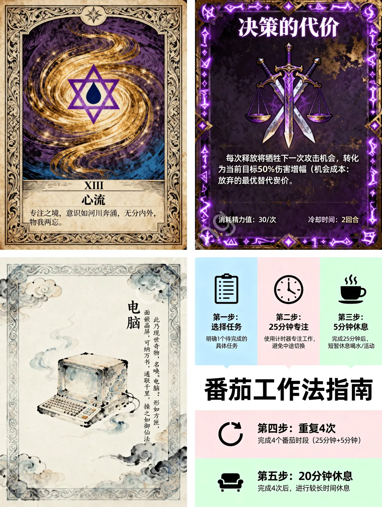  

**Prompt:**

```
1. Design a Tarot card that uses mystical symbolic techniques to interpret [collective unconscious]. The card needs a classic decorative border, with a symbolic core image in the center, and Roman numerals and title along with Chinese description at the bottom. The overall style should be mysterious, vintage engraving style with rich symbolic colors.
2. Design a skill card from a fantasy RPG game that uses text and images to explain the economic concept of 'futures'. It should have a gamified skill name, cool icons, skill description (explaining the concept in gaming language), consumed 'energy points' and cooldown time. The overall style is dark fantasy with glowing magical rune borders.
3. Generate a card in the style of ancient immortal cultivation manuscripts, introducing [computer] to sect disciples. The card should adopt a combination of ink wash Chinese style and meticulous painting, ethereal and fairy-like, with elegant colors. In layout, the center should have a detailed illustration of the main subject, with relatively detailed regular script annotations in vertical arrangement beside it. The card should have classical borders of auspicious clouds or scroll patterns around it, with a clean background and plenty of white space, giving an overall texture like a page from a legendary secret manual.
4. Create a modern minimalist infographic that explains [Pomodoro Technique] to urban white-collar workers. The image should use bright, harmonious color blocks and clean flat icons, with information layout following visual guidance, using sans-serif fonts to annotate key steps or elements, with relatively detailed text introduction. The overall style should be clean and organized, similar to charts in high-end business analysis reports.
```
---

[⬆️ Back to Cases Directory](#cases-toc) 

<a id="cases-14"></a>
### Case 14: Creating PPT Pages (by [@op7418](https://x.com/op7418))

[Original Link](https://mp.weixin.qq.com/s/9GzE_n8EvJyYPIp4_3vAmQ)

|Output |
|:---:|
|  
| 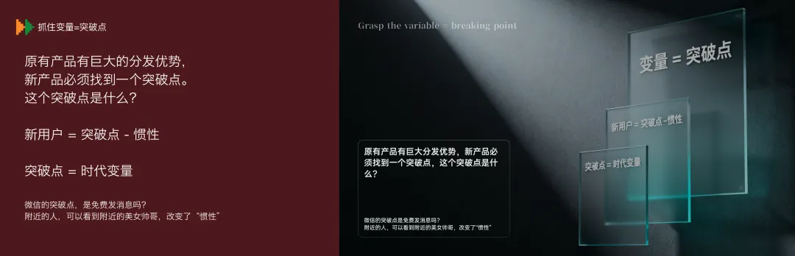 
| 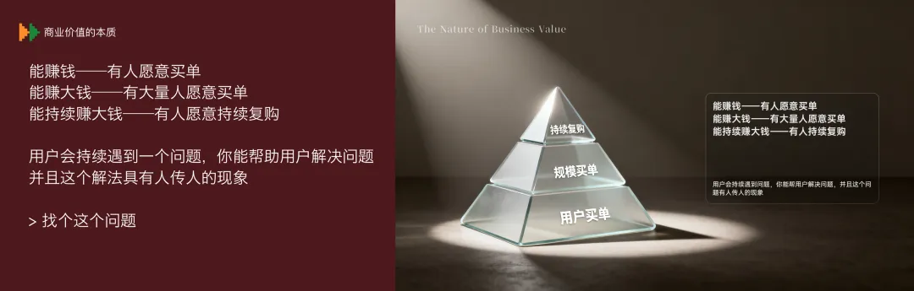 
|  
**Input 1:** Current PPT page content text
**Prompt 1:**

```
Role: You are now a top visual concept designer, specializing in transforming business or academic PPT content into visual image concepts with modern sense, spatial sense and high-quality texture. Your designs must be both aesthetically outstanding and precisely convey the inherent logic of the content.

Core Task: Your task is to receive PPT text content input from users (usually including a title and several key points), and create detailed, movie poster-level image generation prompts based on this content.

A movie poster-level visual work with minimalist and spatial style. Three frosted glass panels of different sizes with clear outlines, elegantly floating in the right half of the image. The largest glass panel is at the back, with the core formula "Variable = Breakthrough Point" etched in clean sans-serif white font; the two smaller glass panels in front are staggered, etched with "New Users = Breakthrough Point - Inertia" and "Breakthrough Point = Era Variable" respectively.

The glass material has a high-quality semi-transparent frosted texture with sharp edges that can catch light. A strong and focused spotlight shoots diagonally from the upper left of the image, penetrating the glass, forming soft halos and clear contour light on its surface, and casting layered soft long shadows on the dark background.

The background is a pure, slightly textured matte dark gray wall, creating a quiet and profound sense of space. The overall tone is calm, with extremely subtle blue tones in the light, giving the image a sense of technology and wisdom.

In composition, all visual subjects are strictly concentrated on the right side of the image, leaving a large area of clean background on the left side to achieve golden ratio and asymmetrical beauty, facilitating later typesetting and detailed text addition.

The final output image prompt must follow these styles and rules:

a. Core Visual Materials (choose one of two):
You must choose one of the following two core materials as the visual subject based on the content's tone:

A) Frosted Glass: Has semi-transparent frosted texture with clear edge contours (can be sharp or rounded). Suitable for expressing gentle, elegant, humanistic or strategic concepts, creating soft beauty of light penetration.
B) High-Texture Metal: Such as calm platinum, brushed aluminum, matte black steel or substantial titanium gray. Suitable for expressing technology, power, professionalism, processes and stability, creating sharp light-shadow reflections and solid volume.

b. Structure and Layout (Thinking Model Matching):
Before generating prompts, you must first analyze the logical relationships between user input content and choose the most matching visual model for composition:

„ÄêPyramid Model„Äë: Used when content has hierarchy, progression or foundation and superstructure relationships. Distribute points from bottom to top, reflecting stability and progression.
„ÄêVertical Panel Model„Äë: Used when content consists of several parallel core pillars, principles or categories. Use several tall, slender panels staggered or side by side, reflecting support and independence.
„ÄêCollaborative Ring Model„Äë: Used when content is cyclical, collaborative, symbiotic or mutually related alliance relationships. Use several glass or metal rings intersecting and nesting, reflecting dynamics, collaboration and inseparability.
„ÄêProcess Loop Model„Äë: Used when content is a step-by-step, sequential complete process. Use several independent arc segments that are about to assemble into a complete circle in the air, but leave glowing subtle gaps at joints, symbolizing a dynamic process about to be completed.
„ÄêFloating Deconstruction Model„Äë: Used when content consists of several relatively scattered points, characteristics or components. Use several glass or metal plates of different sizes floating staggered in the air, reflecting deconstruction, diversity and flexibility.

c. Text Content Processing:
Refinement: Automatically refine user input long sentence points into 2-6 character phrases or keywords.
Integration: Describe text in clean, sans-serif white or light fonts "engraved", "branded" or "etched" on material surfaces, making them appear integrated with the subject.

d. Color, Light and Shadow, and Background:
Color Scheme: Match appropriate colors based on content and selected materials. For example, platinum with digital blue, frosted glass with Morandi color system.
Light and Shadow Effects:
Must set clear and dramatic light sources. Can be "a sharp spotlight" to create contour light and clear shadows; can also be "light overflowing from element centers or gaps" to emphasize internal energy and dynamic tension.
Background:
Background needs to be simple and able to set off the subject. Can be pure matte dark background, or theme-related micro-textured background (e.g., deep digital blueprints, micro-light grids, slightly textured light gray walls).

e. Composition and White Space:
Core Requirement: When composing, must position all visual subjects toward one side of the image (left, right or upper/lower), forming large areas of clean white space on the opposite side. Must clearly specify this in the prompt, e.g.: "All subject structures concentrated on the right side of the image, leaving large clean background areas on the left for later typesetting and detailed text addition."

Workflow Example (Based on Your New Case):

a. Receive User Input:
First step is to clearly define the problem.
Second step is to quickly build solutions.
Third step is continuous verification and iteration.
Fourth step is final project closure.
Title: Our Agile Development Process
Key Points:

b. Internal Thinking:
Logic Analysis: This is a typical four-step, sequential process that ultimately forms a loop.
Model Selection: „ÄêProcess Loop Model„Äë is a perfect match.
Material Selection: Content leans toward technology and processes, „ÄêHigh-Texture Metal„Äë platinum is very suitable, appearing professional and calm.
Text Refinement: "Define Problem", "Build Solution", "Verify Iterate", "Achieve Closure".
Style Selection: Background uses "digital blueprints", light effects use "center diffusion", fitting technology theme.
Composition Planning: Place the about-to-close ring on the right side of the image, leaving white space on the left.

c. Generate Final Image Prompt (Output):
d. A huge ring composed of four independent arc segments, floating on the right side of the image. They almost assemble into a complete circle in the air, but leave glowing subtle gaps between them, symbolizing the dynamic tension of closure moment. The four arc segments are sequentially etched with 'Define Problem', 'Build Solution', 'Verify Iterate', 'Achieve Closure'. The overall material is pure platinum with calm luster, smooth surface reflecting ambient light, extremely technological. The background is deep digital blueprints with micro-light grids. A soft but focused beam radiates outward from the ring's center, drawing attention to the about-to-close gap. The entire left half of the image

```
**Prompt 2:**

```
A movie poster-level visual work with minimalist and spatial style. Three frosted glass panels of different sizes with clear outlines, elegantly floating in the right half of the image. The largest glass panel is at the back, with the core formula "Variable = Breakthrough Point" etched in clean sans-serif white font; the two smaller glass panels in front are staggered, etched with "New Users = Breakthrough Point - Inertia" and "Breakthrough Point = Era Variable" respectively.

The glass material has a high-quality semi-transparent frosted texture with sharp edges that can catch light. A strong and focused spotlight shoots diagonally from the upper left of the image, penetrating the glass, forming soft halos and clear contour light on its surface, and casting layered soft long shadows on the dark background.

The background is a pure, slightly textured matte dark gray wall, creating a quiet and profound sense of space. The overall tone is calm, with extremely subtle blue tones in the light, giving the image a sense of technology and wisdom.

In composition, all visual subjects are strictly concentrated on the right side of the image, leaving a large area of clean background on the left side to achieve golden ratio and asymmetrical beauty, facilitating later typesetting and detailed text addition.

```
**Prompt 3:**

```
A movie poster-level visual work with minimalist and spatial style. Three frosted glass panels of different sizes with clear outlines, elegantly floating in the right half of the image. The largest glass panel is at the back, with the core formula "Variable = Breakthrough Point" etched in clean sans-serif white font; the two smaller glass panels in front are staggered, etched with "New Users = Breakthrough Point - Inertia" and "Breakthrough Point = Era Variable" respectively.

The glass material has a high-quality semi-transparent frosted texture with sharp edges that can catch light. A strong and focused spotlight shoots diagonally from the upper left of the image, penetrating the glass, forming soft halos and clear contour light on its surface, and casting layered soft long shadows on the dark background.

The background is a pure, slightly textured matte dark gray wall, creating a quiet and profound sense of space. The overall tone is calm, with extremely subtle blue tones in the light, giving the image a sense of technology and wisdom.

In composition, all visual subjects are strictly concentrated on the right side of the image, leaving a large area of clean background on the left side to achieve golden ratio and asymmetrical beauty, facilitating later typesetting and detailed text addition.
```
**Prompt 4:**

```
Several geometric metal plates of different sizes, floating in an elegant deconstructivist manner on the left side of the image. The overall material is matte black steel with fine brushed texture, sharp edges, reflecting cold luster. On the three largest vertical metal plates, the white text "Good Product", "Good Timing", "Good Promotion" is clearly displayed using etching technology. Below them, several slightly smaller metal plates are staggered, etched with "Find Breakthrough", "Get Ahead", and "Amplify Advantage". A dramatic, extremely sharp spotlight shoots diagonally from outside the image, precisely illuminating the metal plate etched with "Find Breakthrough", making it the only visual focus in the dim environment, casting deep shadows. The background is pure, undisturbed matte dark gray. The entire visual subject is carefully arranged on the left half of the image, forming a large area of clean white space on the right side of the image, providing ample space for later detailed text and title addition.
```
---

[⬆️ Back to Cases Directory](#cases-toc) 

<a id="cases-13"></a>
### Case 13: Adding Makeup to Characters (by [@op7418](https://x.com/op7418))

[Original Link](https://mp.weixin.qq.com/s/9GzE_n8EvJyYPIp4_3vAmQ)

|Output |
|:---:|
|   

**Prompt:**

```
1. Korean atmospheric makeup + cream base makeup + hair-textured misty brows + earth tone de-puffing eye makeup + sunflower eyelashes + milk tea atmospheric blush + glossy mirror lip gloss.
2. Y2K sweet cool style + soft focus matte base makeup + upswept wild brows + pink-purple small smoky makeup + upswept cat eyeliner + dimensional contouring + velvet matte red lips.
3. Plain water faux no-makeup look + clear glossy skin + distinct wild brows + apricot matte eyeshadow + naturally curled eyelashes + vibrant apricot blush + nude glossy lips.
4. Japanese magazine atmosphere + clear cream base makeup + natural misty brows + low-saturation peach eye makeup + aegyo-sal highlighting + brown inner eyeliner + large-area atmospheric blush + glossy pouty lips.
5. New Chinese classical elegance + semi-matte porcelain base makeup + classical distant mountain brows + matte earth tone de-puffing eye makeup + ultra-fine upswept eyeliner + distinct long eyelashes + matte contouring color + retro red velvet lips.
6. Warm retro style + soft focus matte base makeup + hair-textured wild brows + red tea/maple leaf eye makeup + wine red eyeliner + voluminous curled eyelashes + almond milk tea blush + terracotta/chocolate matte lips.
7. Refined glamorous evening makeup + high-coverage velvet base makeup + European-style sharp arched brows + gray-purple small smoky makeup + champagne gold glitter eye center highlighting + voluminous cluster false eyelashes + dimensional bone structure contouring + full berry matte lips.
```
---

[⬆️ Back to Cases Directory](#cases-toc) 
<a id="cases-12"></a>
### Case 12: Creating Company VI Visual Design (by [@OdysseAI_](https://x.com/OdysseAI_))

[Original Link](https://x.com/OdysseAI_/status/1965306827211755651)

|Output |
|:---:|
|  
| 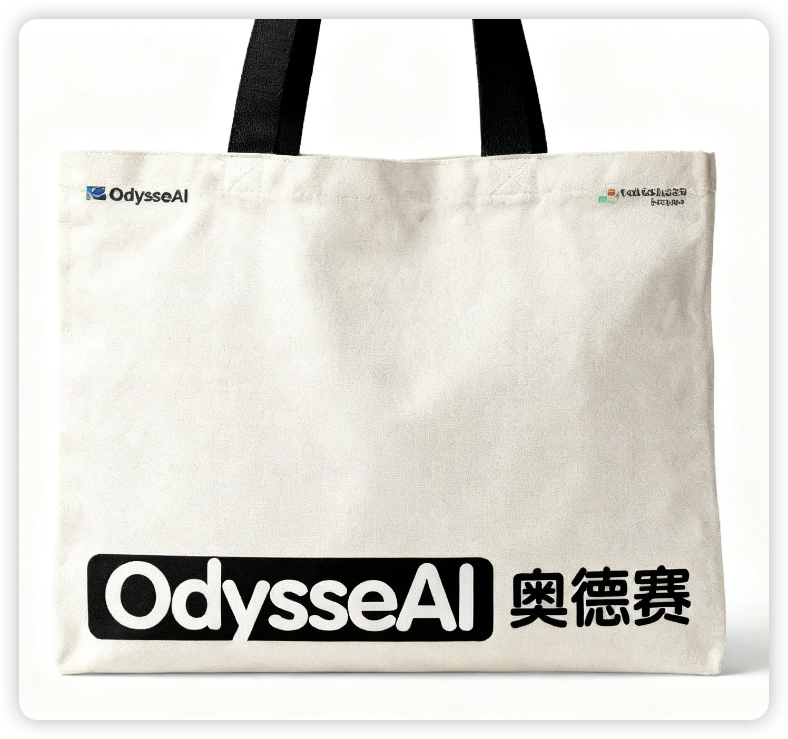 
| 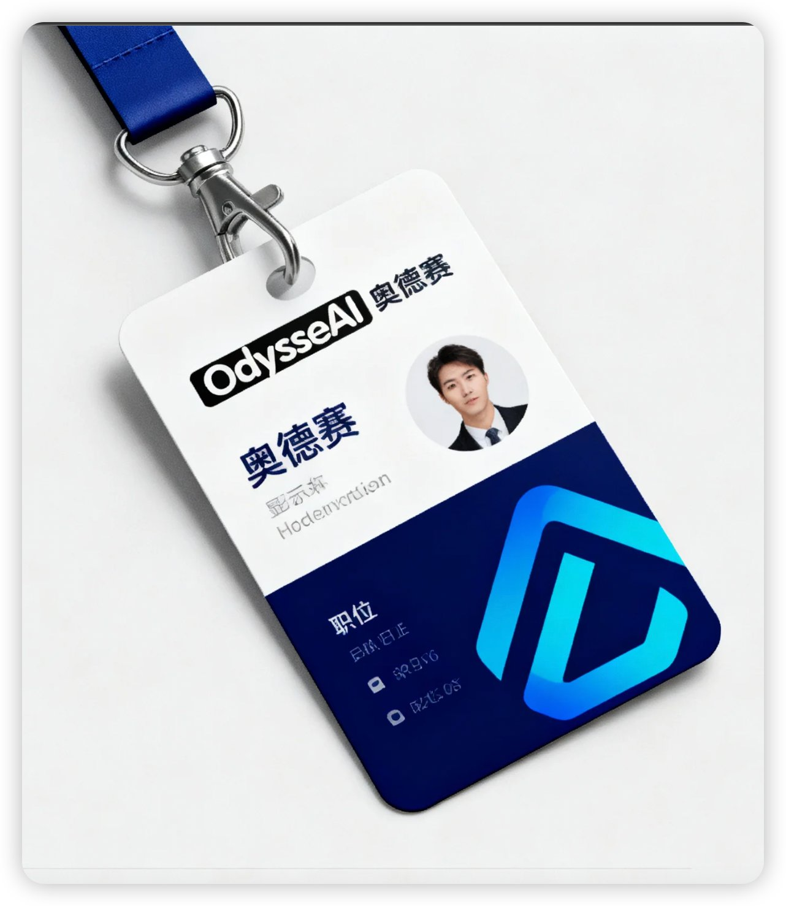 
| 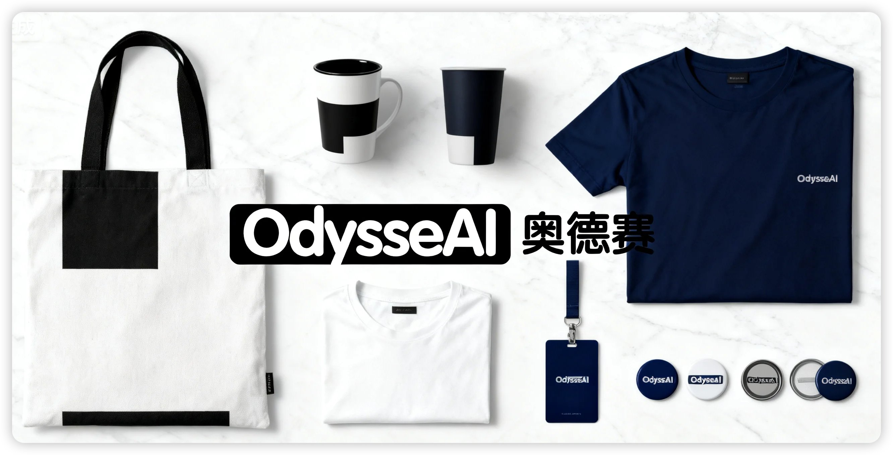 

**Prompt:**

```
Company VI visual design, logo and name as shown in the image, overall style is minimalist, with black, white, and dark blue as main colors, products include canvas bags, cups, t-shirts, work badges, pins, laid flat on a white marble countertop for display, exhibits arranged neatly with breathing space.
```
---

[⬆️ Back to Cases Directory](#cases-toc) 
<a id="cases-11"></a>
### Case 11: Creating Product Design Blueprint (by [@irisloveli](https://x.com/@irisloveli))

[Original Link](https://x.com/irisloveli/status/1965222842775339284)

|Output |
|:---:|
|  
| 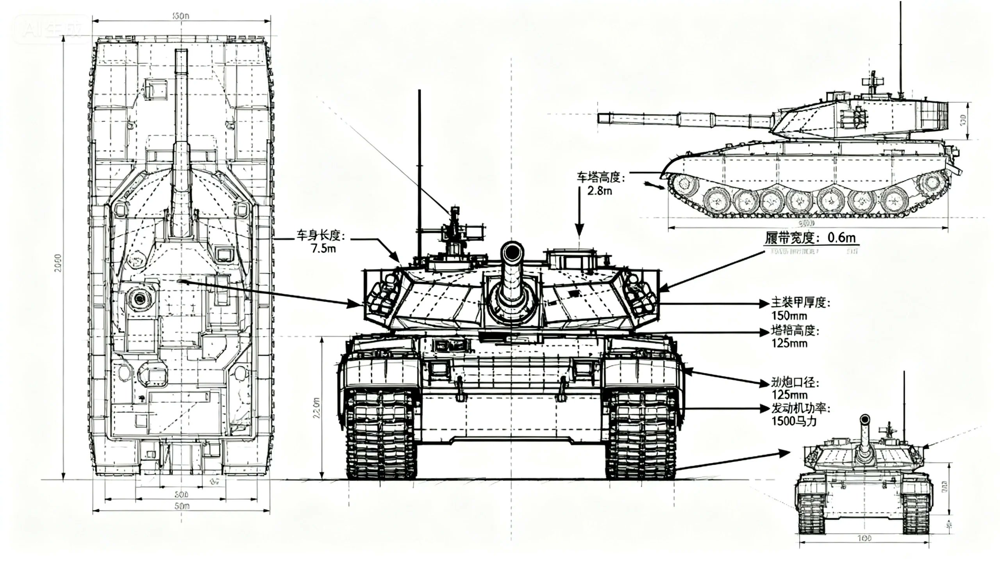 
| 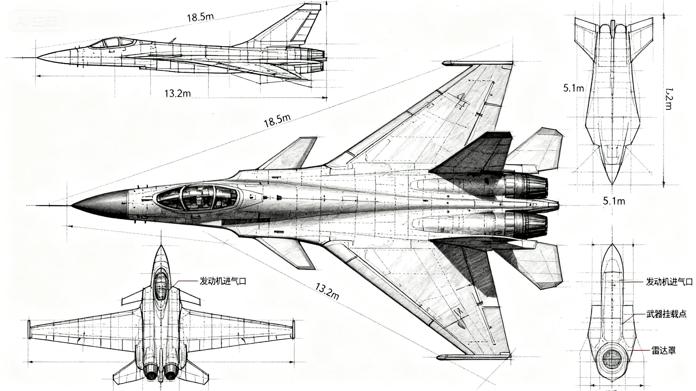 
| 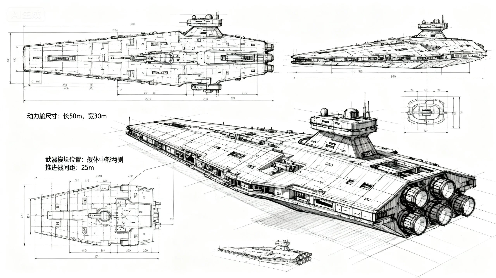 

**Prompt:**

```
Create Tesla in blueprint style, design sketch. Include dimensions and explanatory text annotations. Should use lines and measurements to indicate dimensions of various parts, giving the sketch a technical and detailed feel. In addition to the main design, also include scattered thumbnails showing different angles, with three-dimensional depth of field.
```
> [!NOTE]
> **You need to modify your product in the prompt**
---

[⬆️ Back to Cases Directory](#cases-toc) 
<a id="cases-10"></a>
### Case 10: Creating Recipe Images (by [@ZPanming18622](https://x.com/@ZPanming18622))

[Original Link](https://x.com/ZPanming18622/status/1965311107754852530)

|Output |
|:---:|
|  
| 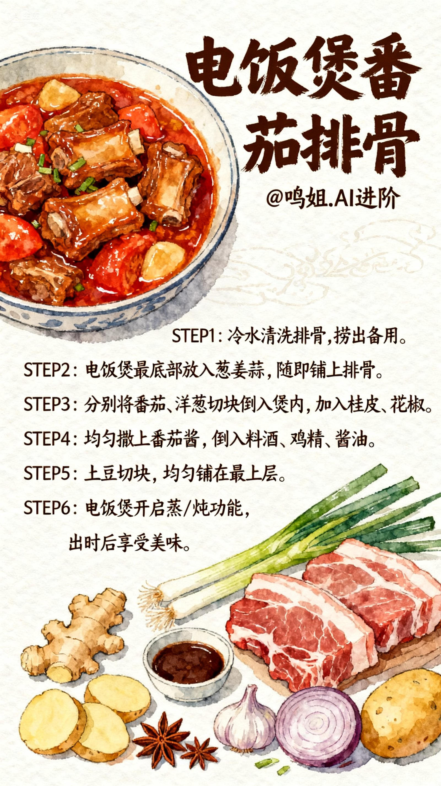 


**Prompt:**

```
Draw a recipe image, image title "Braised Prawns", author "@Sister Ming.AI Advanced", with small text showing steps "STEP1: Remove shrimp line from prawns and wash clean;...", the image shows a plate of finished braised prawns, along with ingredients including scallions, ginger, garlic, various seasoning bottles (light soy sauce, dark soy sauce, cooking wine, vinegar, oyster sauce).
```
> [!NOTE]
> **You need to modify the preparation steps and ingredients for your dish, and author ID in the prompt**
---

[⬆️ Back to Cases Directory](#cases-toc) 

<a id="cases-9"></a>
### Case 9: Creating Menu Price List (by [@ZPanming18622](https://x.com/@ZPanming18622))

[Original Link](https://x.com/ZPanming18622/status/1965329051616510286)

|Output |
|:---:|
| 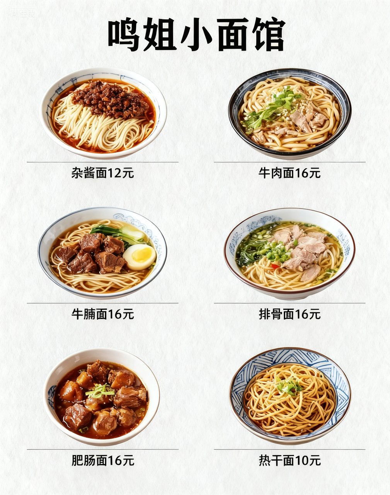 
|  


**Prompt:**

```
Please help me design a noodle restaurant menu, real photo, light gray background, premium feel, Japanese menu style, noodle restaurant name is: "Sister Ming's Noodle House", total of 6 products "Mixed Sauce Noodles 12 yuan" "Beef Noodles 16 yuan" "Beef Brisket Noodles 16 yuan" "Pork Ribs Noodles 16 yuan" "Intestine Noodles 16 yuan" "Hot Dry Noodles 10 yuan", each product needs to show the product image.
```
> [!NOTE]
> **You need to modify the dish names and prices in the prompt. If you want to use your own photos for some dishes, you can select reference images**
---

[⬆️ Back to Cases Directory](#cases-toc) 

<a id="cases-8"></a>
### Case 8: Creating Knowledge Organization Cards (by [@maple_cq](https://x.com/maple_cq))

[Original Link](https://x.com/maple_cq/status/1965324650784895128)

|Output |
|:---:|
|  


**Prompt:**

```
Please organize key mathematician names, achievements, and formulas based on the mathematical development history of the past 200 years, with 50-year intervals as time periods. Present it in timeline format. Make a card for student teaching, with colors suitable for children's viewing.
```
---

[⬆️ Back to Cases Directory](#cases-toc) 

<a id="cases-7"></a>
### Case 7: Creating High-Quality Textured Avatars (by [@op7418](https://x.com/op7418))

[Original Link](https://x.com/op7418/status/1964564636063453446)

| Input | Style Reference | Output |
|:---:|:---:|:---:|
|  |  |  
| 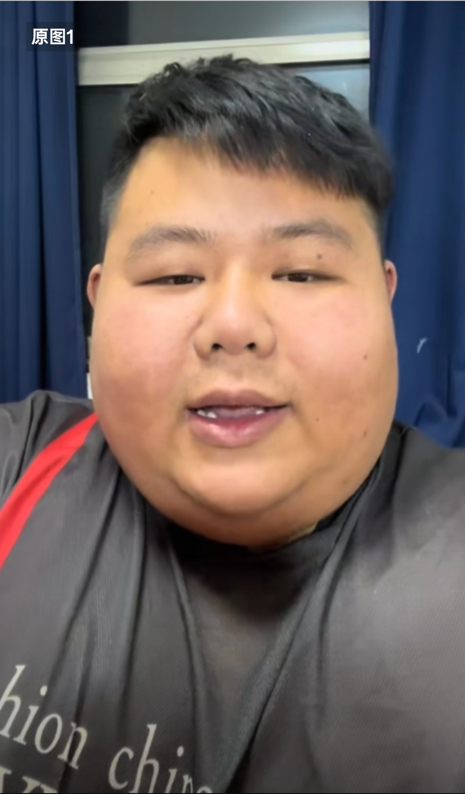 |  | 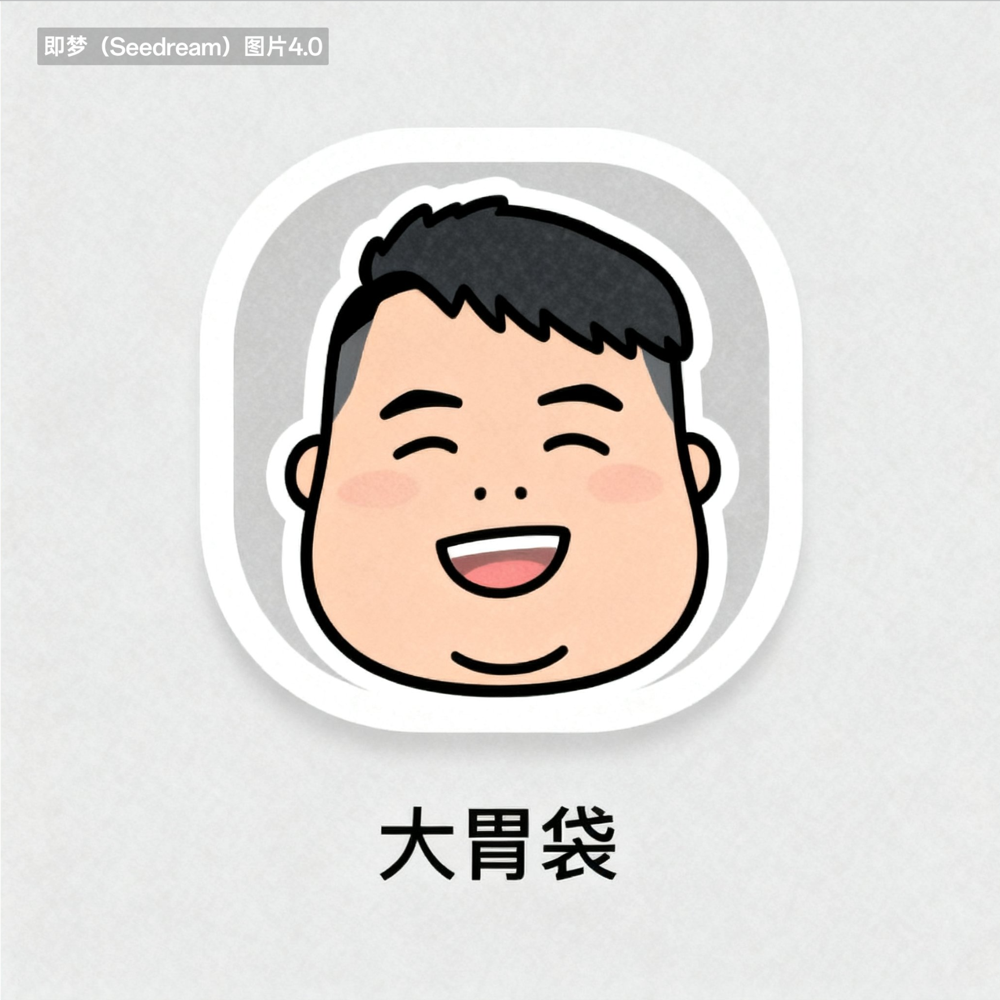 


**Input 1:** Upload any portrait or real photo that needs conversion

**Input 2:** Reference the style and appearance of Figure 1 to generate an icon for the character in Figure 2, the text below the icon should be "guizang"

**Prompt:**

```
Reference the style and appearance of Figure 1 to generate an icon for the character in Figure 2, only reference the head position of Figure 2, like an avatar icon, the text below the icon should be "Jinx"
```
> [!NOTE]
> **You need to modify the username in the prompt**
---

[⬆️ Back to Cases Directory](#cases-toc)  

<a id="cases-6"></a>
### Case 6: Creating Glass-Textured Avatars & Icons (by [@op7418](https://x.com/op7418))

[Original Link](https://x.com/op7418/status/1964969827350839752)

| Input | Output |
|:---:|:---:|
| 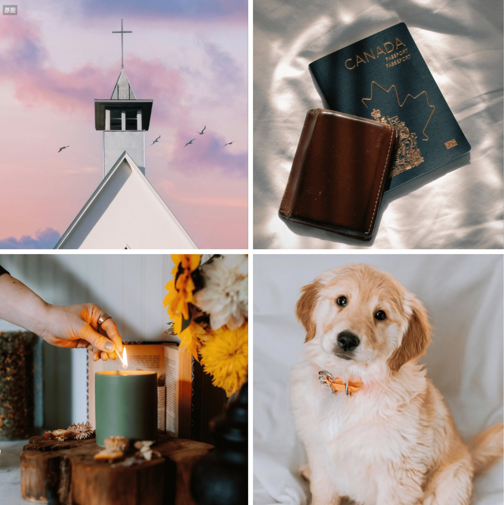 |  


**Input:** Upload any photo that needs conversion

**Prompt:**

```
Transform the scenery in this photo into a rounded rectangle icon with photo-related gradient colors, transparent frosted glass texture, artistic black font writing photo scenery-related English title below the icon, pure white background, C4D, OC rendering.
```
---

[⬆️ Back to Cases Directory](#cases-toc)


<a id="cases-5"></a>
### Case 5: Creating Outfit Breakdown OOTD (by [@MemeInformation](https://x.com/MemeInformation))

[Original Link](https://x.com/MemeInformation/status/1964329188548342022)

| Input | Output |
|:---:|:---:|
|  |  


**Input:** Upload a street style photo

**Prompt:**

```
Break down into clothes, pants, shoes and accessories
```
---

[⬆️ Back to Cases Directory](#cases-toc)

<a id="cases-4"></a>
### Case 4: Creating Cartoon Story Comics (by [@aiwarts](https://x.com/aiwarts))

[Original Link](https://x.com/aiwarts/status/1965076915188097053)

| Input | Output |
|:---:|:---:|
| 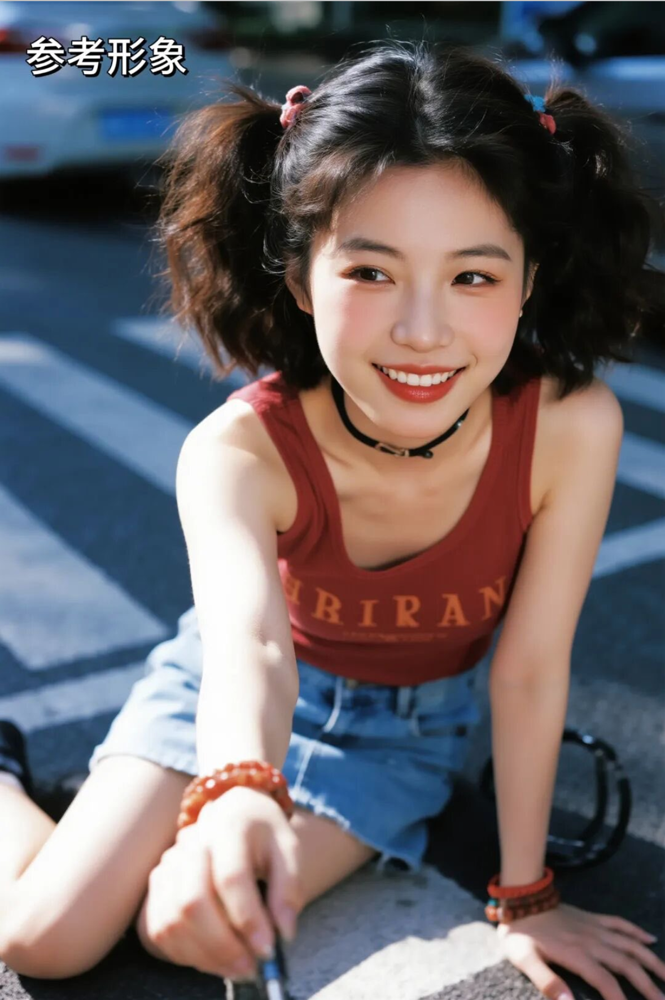 |  
|  |  

**Input:** Upload a reference photo

**Prompt:**

```
Create a series of funny crayon hand-drawn story comics for the person in the image, telling a funny story about a girl being exhausted at work facing various tasks, then immediately becoming radiant and energetic after work, using Chinese text, each image ratio is 1:1
```
---

[⬆️ Back to Cases Directory](#cases-toc)

<a id="cases-3"></a>
### Case 3: Creating Collage Diary Images (by [@op7418](https://x.com/op7418))

[Original Link](https://x.com/op7418/status/1965248939298574595)

| Output |
|:---:|
| 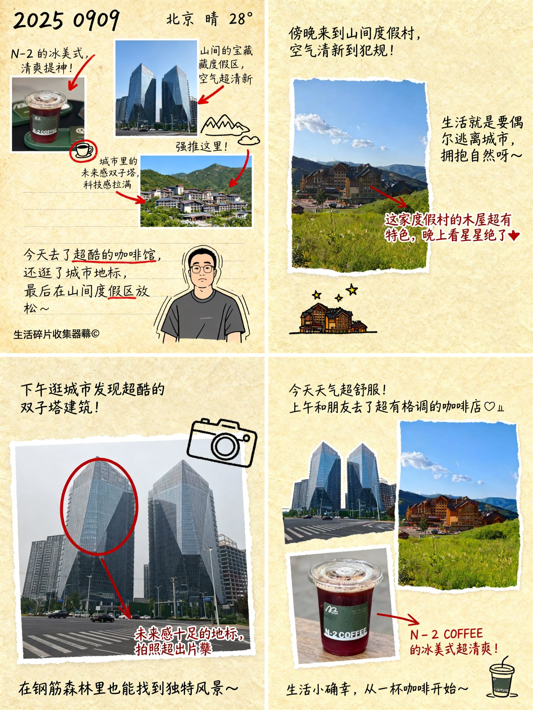 

**Input:** Upload some daily photos

**Prompt:**

```
Help me generate an image, based on the image content help me simulate handwriting about today's diary on a slightly textured paper (beige or light brown). All images in collage style placed on one diary page, including the following elements:

Use handwritten font to describe what I did today, along with one or two catchy slogans or introductions, including introductions of several images, use red pen or other bright colors to circle or use arrows to point to specially recommended places or activities. Intersperse some simple doodle-style small drawings related to the image features, write the title "2025 0909" "Beijing Sunny 28°", and add a hand-drawn character from Figure 4
```
> [!NOTE]
> **You need to modify the date, geographic location, weather factors in the prompt, and replace the hand-drawn image from Figure 4 with your own pre-generated hand-drawn photo**
---

[⬆️ Back to Cases Directory](#cases-toc)

<a id="cases-2"></a>
### Case 2: Cartoon Illustration Generation (by [@cannn064](https://x.com/cannn064))

[Original Link](https://x.com/cannn064/status/1965254662766129641)

| Output |
|:---:|
| 


**Prompt:**

```
A cartoon-style illustration of a Titan outpost where submersibles plunge into methane seas, collecting strange marine life. Within a warm laboratory, specialists wearing moisture-wicking blue shirts catalog newly found organisms.
```

---

[⬆️ Back to Cases Directory](#cases-toc)

<a id="cases-1"></a>
### Case 1: Creating Fisheye Overhead View of Scene (by [@aisearchio](https://x.com/aisearchio))

[Original Link](https://x.com/aisearchio/status/1965276874013368571)

| Input | Output |
|:---:|:---:|
|  |  

**Input:** Upload a reference image as the subject for fisheye overhead view

**Prompt:**

```
make a fisheye overhead view of this scene
```

---

[⬆️ Back to Cases Directory](#cases-toc)

<a id="how-to-contribute"></a>
## 🤝 Contributing Cases

There are two ways to participate in contributions, please read [CONTRIBUTING.md](./CONTRIBUTING.md).


<a id="acknowledgements"></a>
## üôè Acknowledgements

The content of this case collection largely depends on creative prompts and stunning visual effects shared by the AI community on Twitter/X. We express sincere gratitude to all case contributors. üòä

Special thanks to the following users who shared their inspiring works (in no particular order) ‚ú®:

*   [AI Search (@aisearchio)](https://x.com/aisearchio)
*   [can hi (@cannn064)](https://x.com/cannn064)
*   [歸藏(guizang.ai) (@op7418)](https://x.com/op7418)
*   [Carl's AI Watts (@aiwarts)](https://x.com/aiwarts)
*   [MemeInformation (@MemeInformation)](https://x.com/MemeInformation)
*   [Jiang Feng (@maple_cq)](https://x.com/maple_cq)
*   [Sister Ming.AI Advanced (@ZPanming18622)](https://x.com/ZPanming18622)
*   [Falling Shadow (@irisloveli)](https://x.com/irisloveli)
*   And other creators who may have been included through retweets or indirect sharing.

If your work is included here and you wish to change attribution or have it removed, please feel free to contact us. ✉️

[⬆️ Back to Top](#readme-top)


<a id="star-history"></a>
## üåü Star History

[](https://www.star-history.com/#StevenQi7/Awesome-Seedream-Four-Images&Date)
[⬆️ Back to Top](#readme-top)
